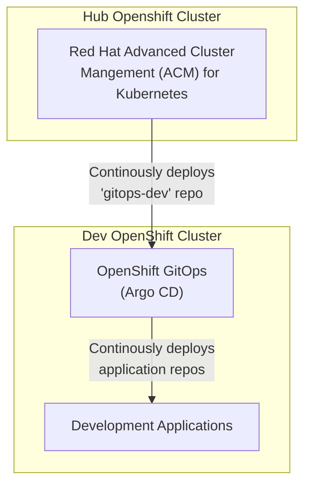

**NOTE: This repo is part of [Hello OpenShift: Multi-Cluster GitOps].** It's
not intended to be referenced directly. Instead, check out the organization's
page for how this repository fits into the greater multi-cluster GitOps
architecture.

# GitOps Configurations for Dev Cluster

This repo contains Argo CD configurations for all applications on the dev
cluster. It contains a Helm chart which deploys Namespaces, AppProjects, and
Applications, based on configurations in values.yaml.

This repo is continuously deployed by ACM to the Dev cluster. The ACM
subscription that deploys this repo is set up in [bootstrap].

## Values

Applications that this chart will deploy are configured in
[values.yaml](values.yaml).

|          Value                                    | Required?   | Description |
| --------------------------------------------      | ----------- | ----------- |
| .Values.appProjects                               |   Yes       | List of projects to deploy |
| .Values.appProjects[].name                        |   Yes       | Name of the Argo CD AppProject and OCP Project (namespace) applications will be deployed into |
| .Values.appProjects[].targetNamespace             |   Optional  | Namespace of the Argo CD AppProject and OCP Project (namespace) applications will be deployed into |
| .Values.appProjects[].gitUrl                      |   Yes       | URL to the Git repo with application Helm charts for this project. NOTE: This URL should end in ".git". |
| .Values.appProjects[].gitBranch                   |   Optional  | Git branch to pull charts from. Default: "main" |
| .Values.appProjects[].valuesFile                  |   Optional  | Helm values file to use relative to each helm chart within a GitOps Project. Default: "values.yaml" |
| .Values.appProjects[].gitUsername                 |   Optional  | Username login for Target repository. |
| .Values.appProjects[].gitPassword                 |   Optional  | Password/PAT for Target repository. |
| .Values.appProjects[].applications                |   Yes       | List of applications to deploy in the project |
| .Values.appProjects[].applications[].name         |   Yes       | Name of the application being deployed. NOTE: THIS MUST BE UNIQUE! Even if deployed into a different project, Argo CD Application names must be unique. |
| .Values.appProjects[].applications[].gitPath      |   Yes       | Path inside the project gitUrl to the Helm chart. Use "." if the chart is in the root of the repo. Use a relative path otherwise. |
| .Values.appProjects[].applications[].valuesFile   |   Optional  | Application values file for a single helm chart (Overwrites $appProject.valuesFile). This value is highest priority. |
| .Values.appProjects[].applications[].syncWave     |   Optional  | Argo / OpenShift GitOps sync wave number. (Lowest number have highest priority) |
| .Values.appProjects[].applications[].autoUpdate   |   Optional  | Determine if an Argo Application should be auto updated. (Default Bool: false) |

[Hello OpenShift: Multi-Cluster GitOps]: https://github.com/hello-openshift-multicluster-gitops
[bootstrap]: https://github.com/hello-openshift-multicluster-gitops/bootstrap
